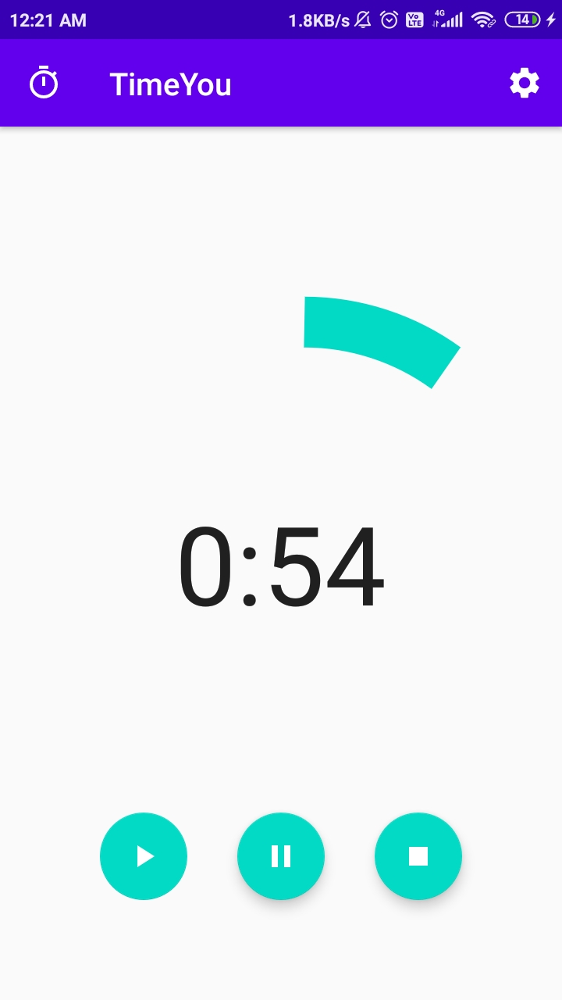
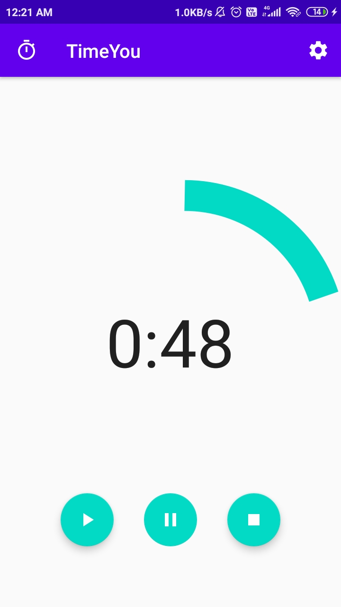

## TimeYou  
My first app in Kotlin.  
It just counts down from 1:00 minute to 0.  
It also has a play, pause and restart button, so that you can play the timer, pause it anytime and restart it.

Some screenshots of the app in action...    

  
  

